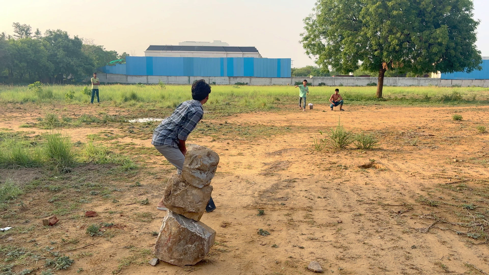
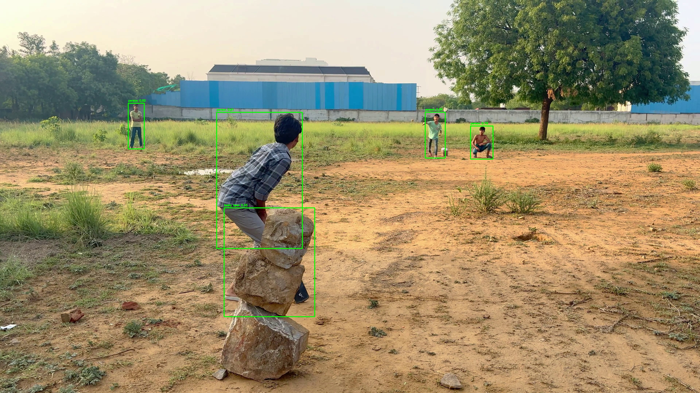

# YOLO Object Detection on Video

Detects objects frame-by-frame in a video using a pretrained YOLOv8 model (Ultralytics) and OpenCV, draws bounding boxes with class labels, displays the result live, and saves it to an output video file.

## Sample Output

| Input | Output (with detections) |
|---|---|
|  |  |

## Requirements

- Python 3.10+
- [ultralytics](https://pypi.org/project/ultralytics/)
- opencv-python

```bash
pip install ultralytics opencv-python
```

## Usage

1. Place your input video and the `yolov8n.pt` model weights in the project folder.
2. Update the `path` and model path inside `object.py` if needed.
3. Run:

```bash
python object.py
```

- Press `q` to stop playback early.
- The annotated video is saved to `output.mp4`.

## How it works

- Reads the video frame-by-frame with `cv2.VideoCapture`.
- Runs each frame through YOLOv8 (`model.predict`) to get bounding boxes, confidence scores, and class IDs.
- Draws boxes and labels on the frame with OpenCV.
- Writes annotated frames to an output video with `cv2.VideoWriter` and displays them in a resizable window.
